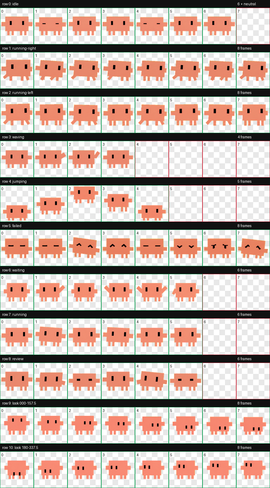

# Codex 橙色方块桌宠

一个为 ChatGPT / Codex 桌面端制作的橙色像素风悬浮桌宠。



## 特点

- Codex Pet v2 格式，精灵图尺寸为 `1536 × 2288`
- 9 种任务状态动画，共 57 个标准动作帧
- 16 个注视方向
- 无嘴巴设计
- 左右侧块是两只手，动作中不会重复生成手臂
- 四条腿按左右两组对称排列
- 已清除绿色与黄绿色抠图色边
- 所有角色动作图均以 image2 生成，再通过 Codex `hatch-pet` 流程组装和校验

## 动作状态

| 状态 | 帧数 |
| --- | ---: |
| 待机 `idle` | 6 + 1 个 neutral 帧 |
| 向右移动 `running-right` | 8 |
| 向左移动 `running-left` | 8 |
| 招手 `waving` | 4 |
| 跳跃 `jumping` | 5 |
| 失败 `failed` | 8 |
| 等待输入 `waiting` | 6 |
| 任务运行中 `running` | 6 |
| 审查中 `review` | 6 |

## 安装

### macOS / Linux

```bash
git clone https://github.com/GaryLauLGY/codex-orange-block-pet.git
cd codex-orange-block-pet
./install.sh
```

然后完全退出并重新打开 ChatGPT 桌面端，进入 **Settings → Pets**，选择 **Codex 方块宠（零绿边版）**，再输入 `/pet` 唤醒。

### 手动安装

将 `pet/` 中的 `pet.json` 和 `spritesheet.webp` 一起复制到：

```text
~/.codex/pets/codex-block-pet-zero-green-v3/
```

## 文件

- `pet/pet.json`：Codex Pet v2 清单
- `pet/spritesheet.webp`：透明背景的 8×11 动画图集
- `preview/contact-sheet.png`：动作总览
- `reports/validation.json`：图集结构与透明度校验报告
- `reports/chroma-despill.json`：绿色边缘净化报告

## 许可

代码与仓库结构使用 MIT License。角色美术素材请在遵守适用平台规则和相关权利的前提下使用。
